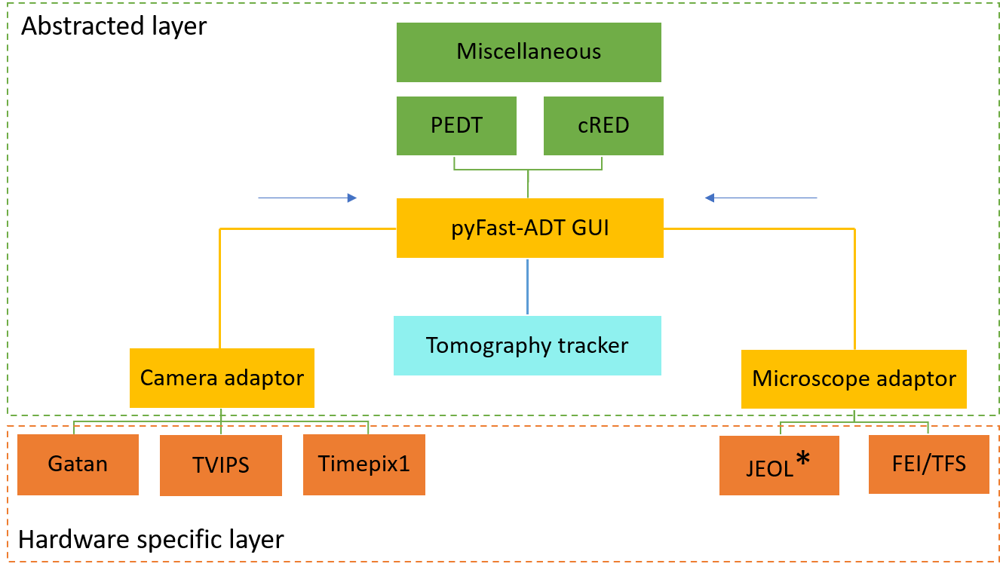

PyFast-ADT
===========================

modules
----------
main\_GUI is just the GUI necessary to setting the microscope and camera adaptor necessary
for your experiment.

Two buttons are available:

- start handpanels; this is a simulator for the handpanel of the microscope to work in remote easier
- start pyFast-ADT; this is the main GUI to control the 3DED data acquisition (usually the main tab you need)

FAST\_ADT\_gui this is the GUI of pyFast-ADT, mainly contain only the tkinter UI objects and methods

fast\_adt\_func collection of the 3DED functions to run PED and cRED experiments and various miscellaneous necessary
for the software
   
beam\_calibration this class handle the change in reference space between the electron beam space and the camera
space coordinates

handpanels\_simulator this class contain the GUI for the hand-panels simulator
   
.. currentmodule:: adaptor.camera.adaptor_cam

The structure of PyFast-ADT
--------------------------------

``PyFast-ADT`` is a python software to automate the acquisition of 3DED data using a Custom Electron Microscopy setup.
``PyFast-ADT`` is structured in order to be "easily" extended and customized to fit the "current and future" needs of
the user.

Abstracting the Microscope and Camera classes (i.e. generally called adaptor) allow the software to be generalized and
not be depend on specific hardware. The user can create a new adaptor for a new microscope or camera by inheriting from
the base classes ``Cam_base`` and ``Microscope_base`` and implementing the necessary methods to support is how custom
setup by using their APIs.
in the following sketch the tree structure of the software is shown to display the relationship between the different
adaptor classes and the ``PyFast-ADT`` GUI.

    *Fig.1 Abstracted structure of pyFast-ADT.*

Interface classes
^^^^^^^^^^^^^^^^^
this line with the power symbol is to generate substructures in the webpage !!!

